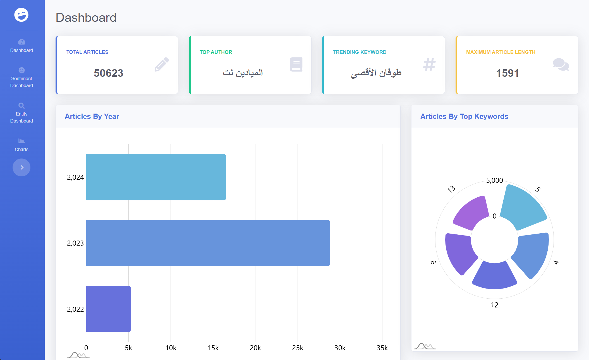
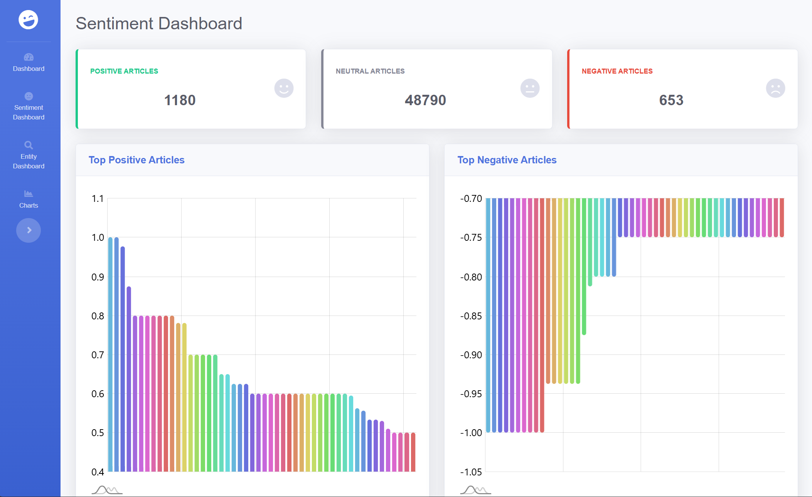
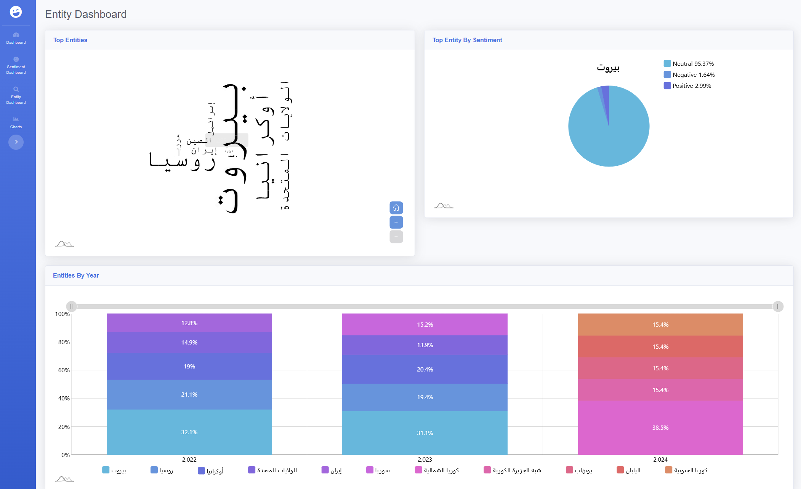
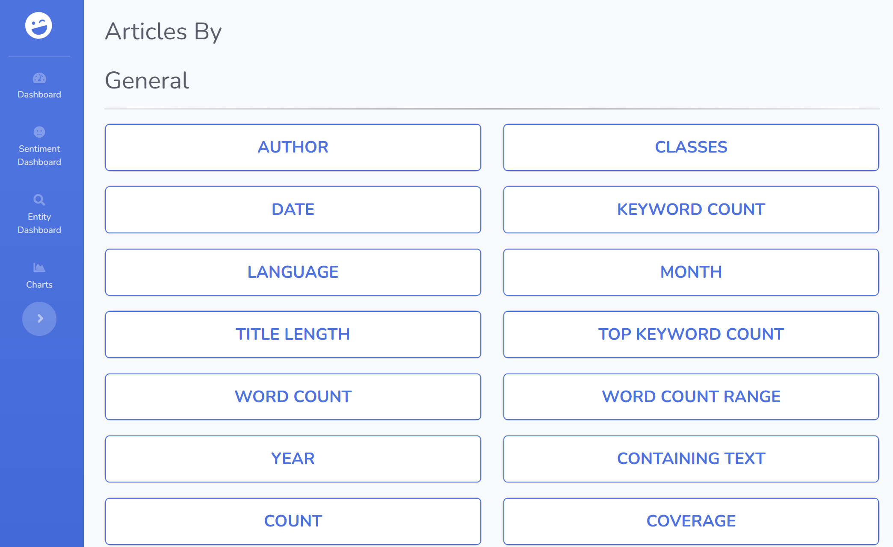

# Article Scraper and Analysis Dashboard

## Project Overview

This project is an **Article Scraper and Analysis Dashboard** that scrapes articles from the web, stores them in a MongoDB collection, and provides insightful visualizations and analysis through a Flask-based web application. The analysis includes **entity recognition** and **sentiment analysis**. The results are displayed on a dashboard with multiple pages, providing users with different types of visualizations.

### Project Structure

1. **`web_scraper.py`**: A Python script to scrape articles from websites using Bootstrap and store them in JSON format. Articles are organized monthly in the `articles` folder.
2. **`data_storage.py`**: A file to store scraped articles in a MongoDB collection.
3. **`app.py`**: A Flask application that serves as the backend. It uses APIs to retrieve and query data from MongoDB.
4. **`sentiment-entity-trend` folder**: contains python scripts to performs entity and sentiment analysis using **TextBlob** and **Stanza**. 
5. **`visualizations` folder**: Contains JavaScript scripts using the **am5charts** library to generate visualizations.
6. **`startbootstrap-sb-admin-2-gh-pages` folder**: The dashboard folder with the following main pages:
   - `index.html`: General dashboard showing overall visualizations.
   - `sentiment.html`: Dashboard with sentiment analysis visualizations.
   - `entity.html`: Dashboard with entity analysis visualizations.
   - `charts.html`: A page with buttons to view charts under three categories: General, Entity, Sentiment.
   - `blank.html`: A template page to display custom charts.

## Features

- **Web scraping**: Uses Bootstrap to scrape articles from websites.
- **MongoDB integration**: Articles are stored in MongoDB for querying and analysis.
- **Sentiment Analysis**: Using TextBlob to analyze the sentiment of the scraped articles.
- **Entity Recognition**: Using Stanza to extract entities from the articles.
- **Dynamic Visualizations**: Created using the am5charts library to display insightful visual data.
- **Interactive Dashboard**: Built with Bootstrap, the dashboard provides an intuitive UI to explore the data and visualizations.

## Usage

### Web Scraping
- Run `web_scraper.py` to scrape articles and store them in the `articles` folder as JSON files, organized by month.

### Data Storage
- Run `data_storage.py` to store the scraped articles in a MongoDB collection.

### API and Data Analysis
- Run `app.py` to start the Flask server. This server serves APIs for querying articles, performing sentiment analysis, and entity recognition.

### Sentiment Analysis
- Run `sentiment.py` to get the sentiment for each article and store it in MongoDB collection.

### Entity Analysis
- Run `entity.py` to get the entities from all the articles and store them as an array of objects in MongoDB

## Setup Instructions

1. Clone the repository:
   ```bash
   git clone https://github.com/MhmdRhayem/Article-Scraper-and-Analysis-Dashboard
   ```

2. Configure MongoDB and ensure it's running.

3. Start the Flask app:
   ```bash
   python app.py
   ```

4. Access the dashboard at `./startbootstrap-sb-admin-2-gh-pages/index.html`.

## Screenshots

### **General Dashboard:**
  

### **Sentiment Analysis Dashboard:**
  

### **Entity Analysis Dashboard:**
  

### **Charts Selection Page:**
  

## Technologies Used

- **Python**: For web scraping, data processing, and API creation.
- **Flask**: To build the server and APIs.
- **MongoDB**: For data storage.
- **am5charts**: For generating visualizations.
- **TextBlob** and **Stanza**: For sentiment and entity analysis.
- **Bootstrap**: For front-end design and dashboard layout.

## Future Enhancements

- **Cloud Deployment**: Deploy the Flask application and MongoDB instance to a cloud platform (e.g., AWS, Heroku, Google Cloud) to make the project accessible from anywhere and to handle scalability.
- **Backend Integration**: Connect the dashboard pages more seamlessly with the backend by using AJAX or fetch API to dynamically load data and update visualizations without needing to reload the page.
- **User Authentication**: Implement user authentication and authorization to secure access to the dashboard and allow different levels of user permissions.
- **Automate Articles Extraction**: Implement a scheduling mechanism to automatically scrape and update articles on a regular basis.